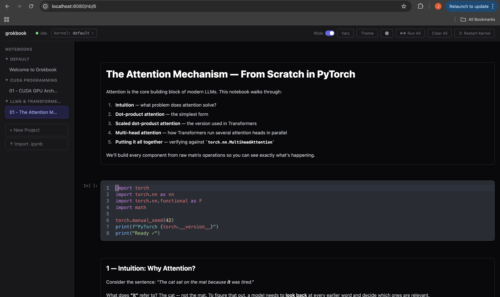

# grokbook

Interactive notebook server for learning computer science. Works like Jupyter — code cells, markdown, persistent IPython kernels — with a built-in MCP server so AI tutors can create and manage notebooks for you.



> **Hey, can you create a new project in Grokbook about LLMs and transformer architecture, and a first notebook to teach me about the attention mechanism in PyTorch? Go step by step, introduce the different components of attention, and use both markdown and code to give me a comprehensive intro.**

## Install

Requires **Python 3.14+** and [uv](https://docs.astral.sh/uv/). uv will auto-install Python 3.14 if you don't have it.

### Run instantly (recommended)

```bash
uvx grokbook
```

That's it. Opens the notebook UI on [localhost:8080](http://localhost:8080) and the MCP server on port 8081. A welcome notebook is created on first run.

If you `cd` into a project directory with a `.venv` first, grokbook auto-picks that `.venv` as the kernel so your project's libraries are available. Otherwise, you pick a kernel from the `kernel:` dropdown in the header (or paste any Python path).

### Install permanently

```bash
uv tool install grokbook
grokbook                   # now on your PATH
```

### From source (dev)

```bash
git clone https://github.com/marco-jeffrey/grokbook.git
cd grokbook
uv sync
uv run grokbook
```

## Usage

```bash
uvx grokbook               # or just `grokbook` after uv tool install
```

Flags:

```bash
uvx grokbook --port 3000                      # different port
uvx grokbook --python /path/to/python         # explicit kernel interpreter
uvx grokbook --allow-code-execution           # enable execute tools for MCP
```

### Kernel auto-detection

Grokbook picks a Python interpreter on startup in this order:

1. `--python` CLI flag (explicit override)
2. `$VIRTUAL_ENV` (if an env is active in your shell)
3. `./.venv/bin/python` or `./venv/bin/python` in the current directory
4. First `uv`-managed Python found via `uv python list`
5. Fallback to the Python grokbook is running under

If the chosen interpreter is missing `ipykernel`, grokbook installs it automatically via `uv pip install --python <env> ipykernel`.

You can also **switch kernels per-notebook** from the UI: click the `kernel:` dropdown in the header → pick any discovered env, or paste a custom path at the bottom. Custom paths persist in `~/.grokbook/custom_envs.json`.

### Remote access (Tailscale / LAN)

By default, grokbook binds to `127.0.0.1` (localhost only). To access from other machines:

```bash
grokbook serve --host 0.0.0.0
```

Both the notebook server and MCP server bind to all interfaces. Access from another machine at `http://<ip>:8080`.

> **Warning**: Grokbook executes arbitrary Python code. Do not expose it to untrusted networks.

### CLI reference

```
grokbook [OPTIONS]                # Start notebook + MCP servers (= grokbook serve)
grokbook serve [OPTIONS]          # (explicit form)
  --host TEXT                     # Bind address (default: 127.0.0.1)
  --port, -p INT                  # Notebook server port (default: 8080)
  --mcp-port INT                  # MCP server port (default: 8081)
  --python PATH                   # Python interpreter for kernels
  --db PATH                       # Database file (default: ~/.grokbook/grokbook.db)
  --allow-code-execution          # Enable execute/kernel tools in MCP

grokbook mcp [OPTIONS]            # MCP server standalone (stdio, for Claude Desktop)
  --allow-code-execution          # Enable execute/kernel tools
```

## MCP Integration

On startup, grokbook prints an MCP config block you can paste directly into Claude Desktop or LM Studio:

```json
{
  "mcpServers": {
    "grokbook": {
      "command": "uvx",
      "args": ["grokbook", "mcp", "--allow-code-execution"],
      "env": {
        "GROKBOOK_API_URL": "http://localhost:8080/api"
      }
    }
  }
}
```

Omit `--allow-code-execution` to restrict the MCP server to read/write operations only (no code execution).

The `grokbook mcp` command runs in stdio mode for Claude Desktop. For HTTP-based MCP clients (LM Studio, remote agents), the built-in MCP server on port 8081 is already running when you start `grokbook serve`.

**Always available**: `list_notebooks`, `get_notebook`, `create_notebook`, `rename_notebook`, `duplicate_notebook`, `list_projects`, `create_project`, `rename_project`, `move_notebook`, `create_cell`, `insert_cell`, `read_cell`, `write_cell`, `delete_cell`, `move_cell`, `duplicate_cell`, `change_cell_type`, `clear_output`, `clear_all_outputs`

**With `--allow-code-execution`**: `execute_cell`, `run_all_cells`, `kernel_status`, `restart_kernel`, `get_variables`, `interrupt_kernel`

To enable code execution via MCP:

```bash
grokbook serve --allow-code-execution
```

## Features

- **Code cells** with streaming execution, rich output (images, HTML, SVG, pandas tables)
- **Markdown cells** with GitHub-flavored rendering
- **Persistent IPython kernels** — one per notebook, variables carry over between cells
- **Per-notebook kernel picker** — auto-discovers `uv`, `.venv`, and jupyter kernelspecs; install `ipykernel` into any env with one click
- **Keyboard-driven** — Vim-like command/edit modes (j/k, a/b, dd, Shift+Enter)
- **Import/export** Jupyter `.ipynb` files
- **Variables inspector** panel
- **Dark/light theme**, wide mode, autocomplete, signature tooltips
- **Live sync** across browser tabs via SSE

## Keyboard Shortcuts

Grokbook uses two modes, inspired by Vim:

**Command mode** (press `Escape` to enter):

| Key | Action |
|-----|--------|
| `j` / `k` | Navigate between cells |
| `Enter` | Edit selected cell |
| `a` / `b` | Insert cell above / below |
| `m` | Convert to markdown |
| `y` | Convert to code |
| `dd` | Delete cell |
| `Cmd+Shift+Up/Down` | Move cell up / down |

**Edit mode** (press `Enter` or click a cell):

| Key | Action |
|-----|--------|
| `Shift+Enter` | Execute cell, move to next |
| `Cmd+Enter` / `Ctrl+Enter` | Execute cell, stay in place |
| `Escape` | Back to command mode |
| `Tab` / `Shift+Tab` | Indent / dedent |

### Vim mode

Enable Vim keybindings from the editor settings panel (gear icon). When active:

- Full Vim motions in code cells (normal, insert, visual modes)
- `jk` is mapped to `Escape` in insert mode for quick mode switching
- Block cursor in normal mode, line cursor in insert mode

## Architecture

```
Browser ──SSE──▶ Stario server (:8080) ──ZMQ──▶ IPython kernel
   │                  │
   │  Datastar        │  SQLite (~/.grokbook/grokbook.db)
   │  (reactive       │
   │   signals)       ├── REST API (/api)
   │                  │
   ▼                  ▼
 DOM patches      MCP server (:8081)
 via SSE          (FastMCP, for LLM agents)
```

## License

MIT
